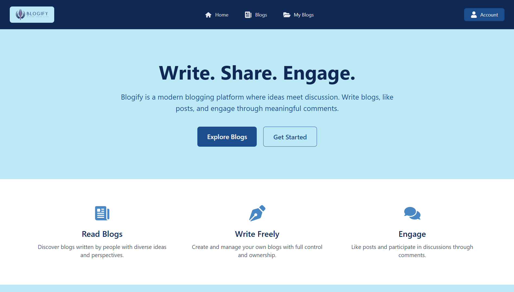
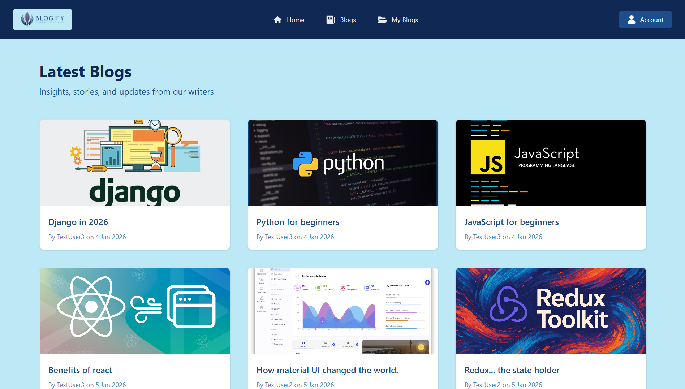
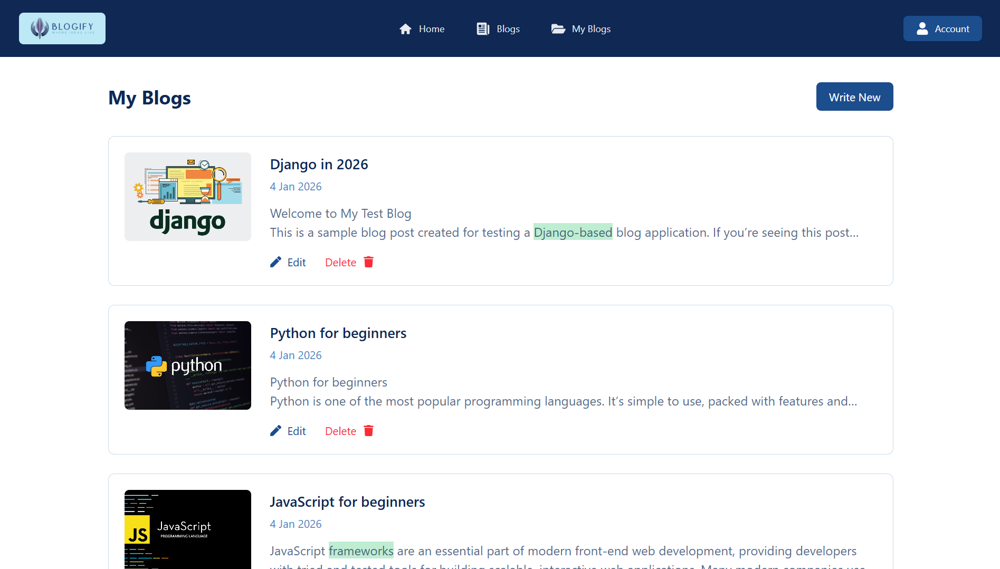
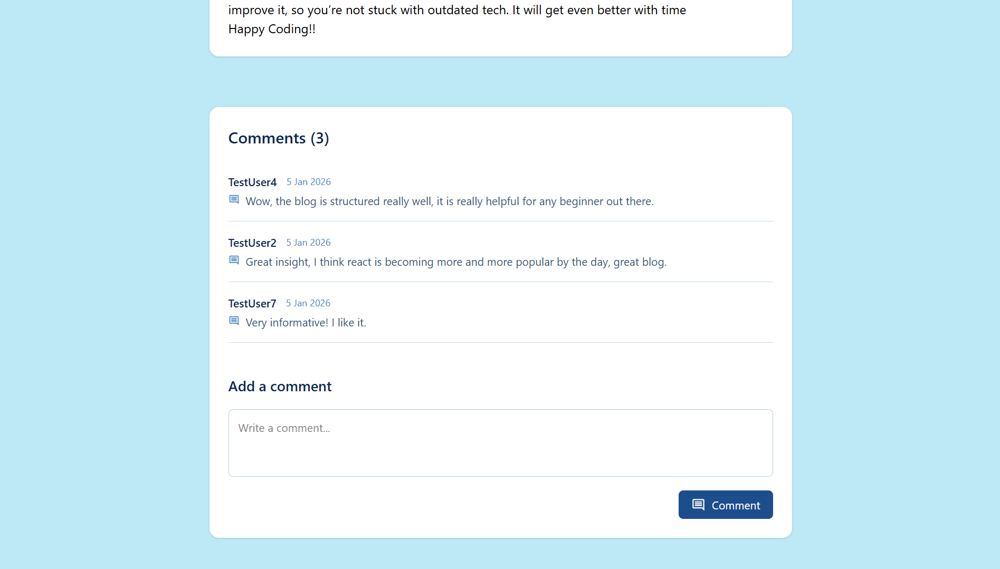

# Blogify

A full stack blog application deployed on **vercel** and **render** created by **react**, **django** and **Django REST Framework** that can serve blogs to all users, blogs can be **liked**, **commented** on and **created** by logged in users and blogs can be **edited** and **deleted** by users who created the blog. This app features authentication, protected routes, text editing, and dynamic APIs.

## Features

- User **authentication** & **authorization**
- Protected routes
- Rich text editor to write blog **(TinyMCE)**
- Create, update, edite and delete blogs
- Pagination to navigate through blogs
- API Versions
- Server side caching to enhance performance
- Form handling with **react hook form**
- Global state handling with **redux**
- Deployed frotend and backend

## Live Demo

- **Backend** - [Render](https://blogify-r0zw.onrender.com)
- **Frontend** - [Vercel](https://blogify-gamma-henna.vercel.app)

> **NOTE:** Please let the backend boot completely upon visiting the link before loading the frontend. Use demo account with username `demo` and password `demopass` to surf the application. Also if you decide to visit, comment on any blog with your name and text **`"I was here"`**

## Screenshots

<!-- 



 -->

<p align="center">
  
  <p align="center">Classy Home Page</p>
</p>
<hr/>
<p align="center">
  
  <p align="center" >Visit Blogs</p>
</p>
<hr/>
<p align="center">
  
  <p align="center">Handle Your Personal Blogs</p>
</p>
<hr/>
<p align="center">
  
  <p align="center">Interact with people online</p>
</p>
<hr/>
<p align="center">
  
  <p align="center">Manage Your Account</p>
</p>

## Tech Stack

### Frontend
- React
- Redux Toolkit
- React Hook Form
- TinyMCE

### Backend
- Django
- Django REST Framework
- JWT Authentication
- Pagination

### Infrastructure
- Vercel (frontend deployment)
- Render (backend deployment)
- PostgreSQL

## Getting started

### Backend

```bash
git clone "https://github.com/paritoshAuminus/blogify"
cd Blogify/backend
pip install -r requirements.txt
python manage.py migrate
python manage.py runserver
```

> Make sure you have **python** intalled before running the commands

### Frontend

```bash
cd blog-frontend
npm install
npm start
```

## Future improvements
- Adding a subscribing feature that allows logged in users to subscribe to different authors
- Implementing search feature for user to search through blogs

## Author

- Built by Paritosh 
- Full-stack developer (React + Django)

## Connect with me

- gitHub - [paritoshAuminus](https://github.com/paritoshAuminus)
- linked In - [paritoshAuminus](https://www.linkedin.com/in/paritoshauminus/)


